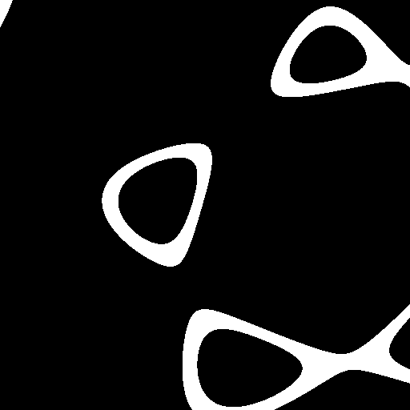
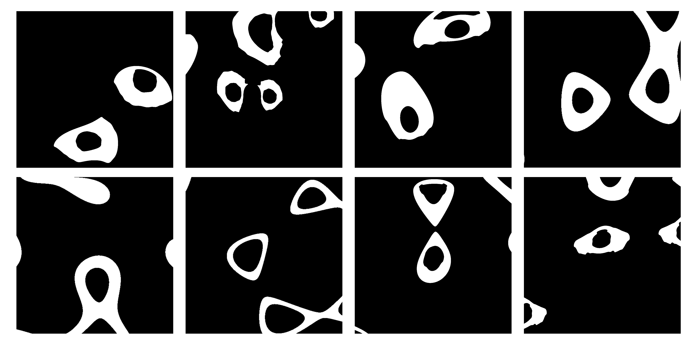
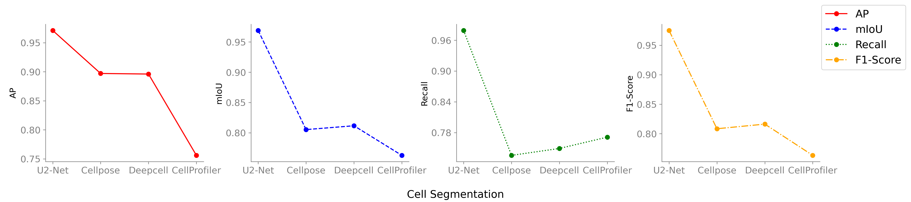
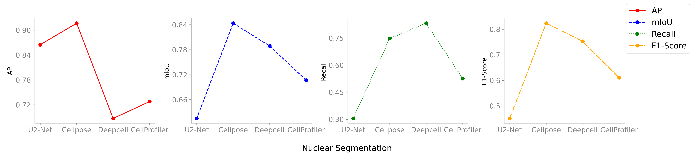
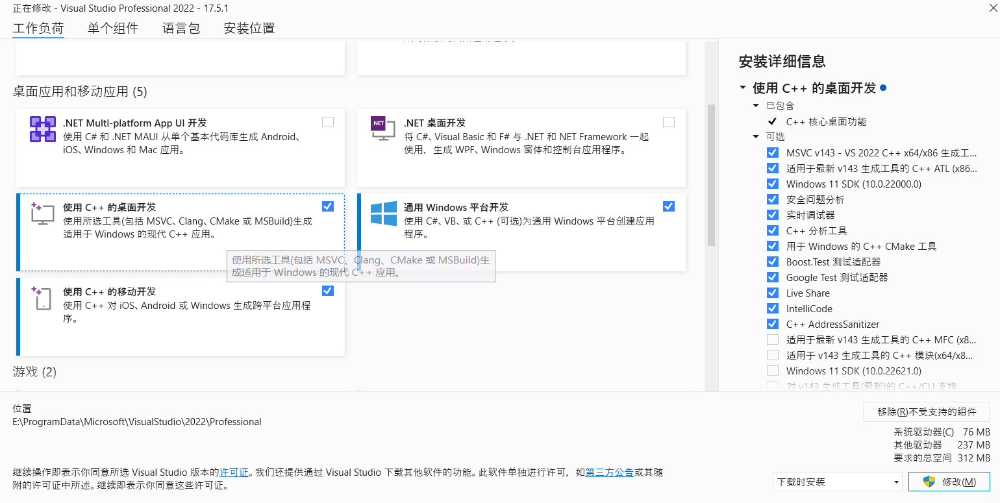
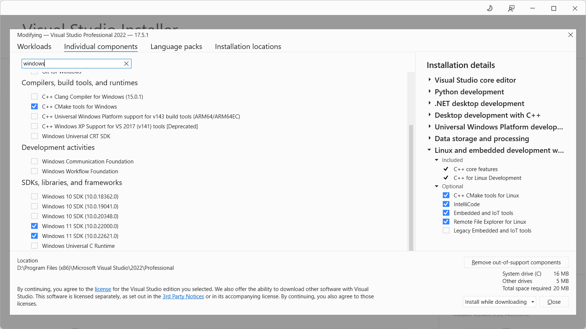

---

---

# Fluorescent Cell Generation Document

Medical image segmentation algorithms can extract key information from automatically generated images of specific tissues, eliminating the enormous amount of time spent manually drawing medical images in clinical settings, and thus becoming a hot research topic for scholars. However, the problem with evaluating segmentation performance of existing medical image segmentation algorithms is that they require high-precision annotated cell datasets as support, but manually annotated cells inevitably contain errors, which is not conducive to model generalization. To address this issue, this method proposes a cell generation method based on conditional generative adversarial networks.

Firstly, the StyleGAN3 network is used to train the cell's mask to obtain a mask image that can control style information. Then, features are trained using the Pix2PixHD network, and the mask image obtained in the previous step is used as input to obtain cell images that fully conform to semantic information. Finally, this method inputs the generated cell images into existing medical image segmentation algorithms to measure the performance of the model, truly reflecting the strengths and weaknesses of various algorithms.

In the process of image generation, StyleGAN3 and Pix2PixHD models are used, and the specific technical details are as follows:

## Requirements

- Linux and Windows are supported, but we recommend Linux for performance and compatibility reasons.
- 1–8 high-end NVIDIA GPUs with at least 12 GB of memory. 
- 64-bit Python 3.8 and PyTorch 1.12.0 (or later). See https://pytorch.org for PyTorch install instructions. CUDA toolkit 11.6 or later.
- GCC 7 or later (Linux) or Visual Studio (Windows) compilers. Recommended GCC version depends on CUDA version, see for example [CUDA 11.6 system requirements](https://docs.nvidia.com/cuda/archive/11.6.0/cuda-installation-guide-linux/index.html#system-requirements).
- Python libraries: see `environment.yml `for exact library dependencies. You can use the following commands with Miniconda3/Anaconda3 to create and activate your cell Python environment:
  - `conda env create -f environment.yml`
  - `conda activate cell`

## Getting Started

- Clone this repo:

```bash
git clone https://github.com/RaynTang/CellGen.git
cd 01_mask_generation
```

You can use the code in the `01_mask_generation` folder to generate cell masks. The entire code is based on the StyleGAN3.

## 1.Stylegan3

### 1.1 Preparing datasets

You can put your images in a folder to create your custom dataset; use `python dataset_tool.py --help` for more detailed information. Additionally, the folder can be used as a dataset directly without running `dataset_tool.py` first, but this may lead to suboptimal results.

```bash
# Original 1024x1024 resolution.
python dataset_tool.py --source=./your/path/images1024x1024 --dest=./datasets/images-1024x1024.zip

# Scaled down 256x256 resolution.
python dataset_tool.py --source=./your/path/images1024x1024 --dest=~/datasets/images-256x256.zip \
--resolution=256x256
```

Please note that the above command will create a single combined dataset using all images from all categories in the folder, matching the setting used in the StyleGAN3 paper. Additionally, you can also create a separate dataset for each category.

```bash
python dataset_tool.py --source=./your/path/cell1024x1024 --dest=~/datasets/cell-1024x1024.zip
python dataset_tool.py --source=./your/path/nucleus1024x1024 --dest=~/datasets/Nucleus-1024x1024.zip
```

### 1.2 Training

You can use `train.py` to train a new neural network, for example:

```bash
# Train StyleGAN3-T for Dataset using 8 GPUs.
python train.py --outdir=~/training-runs --cfg=stylegan3-t --data=~/datasets/images-1024x1024.zip \
    --gpus=8 --batch=32 --gamma=8.2 --mirror=1

# Fine-tune StyleGAN3-R for Dataset using 1 GPU, starting from the pre-trained FFHQ-U pickle.
python train.py --outdir=~/training-runs --cfg=stylegan3-r --data=~/datasets/images-1024x1024.zip \
    --gpus=8 --batch=32 --gamma=6.6 --mirror=1 --kimg=5000 --snap=5 \
    --resume=https://api.ngc.nvidia.com/v2/models/nvidia/research/stylegan3/versions/1/files/stylegan3-r-ffhqu-1024x1024.pkl

# Train StyleGAN2 for Dataset at 1024x1024 resolution using 8 GPUs.
python train.py --outdir=~/training-runs --cfg=stylegan2 --data=~/datasets/images-1024x1024.zip \
    --gpus=8 --batch=32 --gamma=10 --mirror=1 --aug=noaug
```

Note that the result quality and training time depend heavily on the exact set of options. The most important ones (`--gpus`, `--batch`, and `--gamma`) must be specified explicitly, and they should be selected with care. See [`python train.py --help`](./docs/train-help.txt) for the full list of options and [Training configurations](./docs/configs.md) for general guidelines &amp; recommendations, along with the expected training speed &amp; memory usage in different scenarios.

The results of each training run are saved to a newly created directory, for example `~/training-runs/00000-stylegan3-t-afhqv2-512x512-gpus8-batch32-gamma8.2`. The training loop exports network pickles (`network-snapshot-<KIMG>.pkl`) and random image grids (`fakes<KIMG>.png`) at regular intervals (controlled by `--snap`). For each exported pickle, it evaluates FID (controlled by `--metrics`) and logs the result in `metric-fid50k_full.jsonl`. It also records various statistics in `training_stats.jsonl`, as well as `*.tfevents` if TensorBoard is installed.

### 1.3 Testing

Trained networks are stored as `*.pkl` files that can be referenced using local filenames :

```bash
# Generate an image using a model .
python gen_images.py --outdir=~/out --trunc=1 --seeds=2 \
    --network=~/training-runs/00000-stylegan3-r-labels1024x1024-gpus1-batch2-gamma8.8/network-snapshot-000220.pkl
    # Generate multiple images using a model .
python gen_images.py --outdir=~/out --trunc=1 --seeds=1-100 \
    --network=~/training-runs/00000-stylegan3-r-labels1024x1024-gpus1-batch2-gamma8.8/network-snapshot-000220.pkl
```

### 1.5 Image Converter

To ensure that the images generated by StyleGAN3 are binarized, you can use `Tools/Threshold.py` to convert the generated images into standard binary images. 

### 1.6 Results

The parameter that requires the most adjustment is the per-dataset basis R1 regularization weight. This parameter typically has a quadratic relationship with the resolution of the training set, such that if the resolution increases from 256x256 to 512x512, the corresponding gamma value would increase from 2 to 8. The values for -r and -t are consistent with, but slightly lower than, those used in StyleGAN2.

Generally speaking, smaller values of gamma lead to more stable training results, but also result in less variation in the generated images. On the other hand, larger gamma values result in more varied styles in the training output, but also increase the risk of instability and failure.


​                                                   



## 2.Pix2pixHD

### 2.1 Training

```bash
# Traina model at 1024 x 1024 resolution
python train.py --name cell--label_nc 0 --dataroot ./your/data/path/ --no_instance
```

To view training results, please checkout intermediate results in `./checkpoints/cell/web/index.html`.
If you have tensorflow installed, you can see tensorboard logs in `./checkpoints/cell/logs` by adding `--tf_log` to the training scripts.

#### Training with your own dataset

- If you want to train with your own dataset, please generate label maps which are one-channel whose pixel values correspond to the object labels (i.e. 0,1,...,N-1, where N is the number of labels). This is because we need to generate one-hot vectors from the label maps. Please also specity `--label_nc N` during both training and testing.
- If your input is not a label map, please just specify `--label_nc 0` which will directly use the RGB colors as input. The folders should then be named `train_A`, `train_B` instead of `train_label`, `train_img`, where the goal is to translate images from A to B.
- If you don't have instance maps or don't want to use them, please specify `--no_instance`.
- The default setting for preprocessing is `scale_width`, which will scale the width of all training images to `opt.loadSize` (1024) while keeping the aspect ratio. If you want a different setting, please change it by using the `--resize_or_crop` option. For example, `scale_width_and_crop` first resizes the image to have width `opt.loadSize` and then does random cropping of size `(opt.fineSize, opt.fineSize)`. `crop` skips the resizing step and only performs random cropping. If you don't want any preprocessing, please specify `none`, which will do nothing other than making sure the image is divisible by 32.

### 2.2 Testing

```bash
# Test the model
python test.py --name cell --label_nc 0 --no_instance --which_epoch 80 --how_many 10
```

### 2.3 Details

Generating and analyzing fluorescence spots in fluorescence cell images is often difficult due to the weak signal of the fluorescent points. It is challenging to generate realistic fluorescent points directly using Pix2PixHD networks.

However, in Pix2PixHD, you can train your cell image and fluorescent point image simultaneously, and the mask for the fluorescent points can be generated by a 2D Gaussian distribution, which is provided in `Tools/Points.py`.

- $x_i$ and $y_i$ are the center points for the 2D Gaussian data.
- If your cell image is more circular, you can use `shifted_gaussian = np.random.randn(n_samples, 2)` to generate your data points.
- If your cell image is more elongated, you can use:

```python
# generate zero centered stretched Gaussian data
C = np.array([[-5, 2], [5, 0]])
stretched_gaussian = np.dot(np.random.randn(n_samples, 2), C)
```

Input the generated fluorescent point mask into the trained Pix2PixHD fluorescent point generation model to generate realistic fluorescent point images. Then, you can combine the fluorescent image with the fluorescent points using `Tools/Combine.py`.

### 2.4 More Training/Test Details

- Flags: see `options/train_options.py` and `options/base_options.py` for all the training flags; see `options/test_options.py` and `options/base_options.py` for all the test flags.
- Instance map: we take in both label maps and instance maps as input. If you don't want to use instance maps, please specify the flag `--no_instance`.


### 2.5 Results

In our approach, we employed an open-source dataset of cells and fluorescent points to train the Pix2PixHD network. By using the binary masks of randomly positioned points and masks of cells that were trained in StyleGAN3, we were able to generate high-quality fluorescent point images, resulting in improved visibility and detection performance. Finally, we overlaid the generated fluorescent point images onto cell images, producing fluorescent cell images with known fluorescent point distributions.


## 3.Image Segmentation

At this stage, we will use the generated dataset to compare the performance of various segmentation algorithms. This process involves inputting the generated dataset into different segmentation algorithms and evaluating their performance and effectiveness. By comparing different algorithms, we can find the segmentation algorithm that is most suitable for a specific task, which can help us improve the accuracy and efficiency of segmentation in practical applications. This can reduce the workload of manual segmentation, speed up the analysis of large amounts of data, and help discover hidden patterns and structures in the data. Ultimately, this process is expected to improve our understanding and knowledge of the data, laying the foundation for further research and applications.

### 3.1 [Cellpose](https://www.cellpose.org/)

The traditional watershed method can achieve good segmentation results for objects with clear boundaries, as the algorithm can form small "basins" that represent individual objects. However, in most cases, different objects form basins with varying depths (intensities), making it difficult to perform unified segmentation. Therefore, creating an Intermediate Representation (IR) about objects to form a unified topological basin is a good approach. Cellpose uses Simulated Diffusion to simulate the spread of the mask and form a topological map of the vector field. 

#### 3.1.1 Run Cellpose in GUI

```bash
# Install cellpose and the GUI dependencies from your base environment using the command
python -m pip install cellpose[gui]

# The quickest way to start is to open the GUI from a command line terminal.
python -m cellpose
```

- Load an image in the GUI (by dragging and dropping the image or by selecting "Load" from the File menu).
- Set the model: Cellpose has two models, cytoplasm and nuclei, which correspond to the segmentation of cell cytoplasm and cell nuclei, respectively.
- Set the channels: Select the image channel to be segmented. If segmenting cytoplasm, select the green channel; if segmenting nuclei, select the red/blue channel. If there are both cytoplasm and nuclei in the image, set chan to the channel where cytoplasm appears, and set chan2 to the channel where nuclei appear. If segmenting cytoplasm but there is no nucleus, only set chan and leave chan2 as None.
- Click on the calibrate button to estimate the size of objects in the image. Alternatively, manually input the cell diameter for calibration. The estimated size will be reflected by a red circle in the lower left corner.
- Click on the "run segmentation" button to start the segmentation process. You can choose to display the segmentation mask by checking the "MASKS ON" option.

#### 3.1.2 Run Cellpose in Terminal

The parameter inputs in the GUI interface can also be achieved through the terminal mode:

```bash
python -m cellpose --dir ~/images_cyto/test/ --pretrained_model cyto --chan 2 --chan2 3 --save_png
```

All parameters can be viewed using the help parameter:

```bash
python -m cellpose -h
```

#### 3.1.3 Run Cellpose in Code

Similar to the previous two methods, Cellpose can also be called directly in Python code for programming: translation:

```python
from cellpose import models
import skimage.io

model = models.Cellpose(gpu=False, model_type='cyto')

files = ['img0.tif', 'img1.tif']

imgs = [skimage.io.imread(f) for f in files]

masks, flows, styles, diams = model.eval(imgs, diameter=None, channels=[0,0],
                                         threshold=0.4, do_3D=False)
```

### 3.2 Cellpofiler

[CellProfiler](https://cellprofiler.org/) is a free software developed by the Broad Institute of Harvard and MIT. It is designed to enable biologists to quantitatively measure phenotypes of thousands of images automatically, without the need for computer vision or programming training.

### 3.3 Deepcell

Researchers have developed a deep learning segmentation algorithm, Mesmer, which consists of a ResNet50 backbone and a feature pyramid network. It automatically extracts key cell features, such as subcellular localization of protein signals, achieving human-level performance.

#### Run Deepcell

Visit the pre-trained deep learning models on [deepcell.org](https://deepcell.org/). This website allows you to easily upload example images, run them on available models, and download the results without any local installation required.

### 3.4 U2-Net

U2-Net has an architecture of a two-level nested U-structure:

- It proposes the Residual U-Block (RSU) which blends different sizes of receptive fields and can capture more contextual information from different scales.
- Pooling operations are used in these RSU blocks, which increase the depth of the entire architecture without significantly increasing computational cost.

### 3.4 Results





## 4.Tips

If you are running code on Windows, you need to first install Visual Studio and the libraries for C++ desktop development. You also need to configure the environment variables Path, LIB, and INCLUDE in Visual Studio. Their contents might look like:





- Path=D:\Program Files (x86)\Microsoft Visual Studio\2022\Professional\VC\Tools\MSVC\14.35.32215\bin\Hostx64\x64;

- LIB=D:\Program Files (x86)\Microsoft Visual Studio\2022\Professional\VC\Tools\MSVC\14.35.32215\lib\x64;

  ​		D:\Windows Kits\10\Lib\10.0.22621.0\ucrt\x64;

- INCLUDE=D:\Program Files (x86)\Microsoft Visual Studio\2022\Professional\VC\Tools\MSVC\14.35.32215\include;

  ​				  D:\Windows Kits\10\Include\10.0.22621.0\ucrt;
