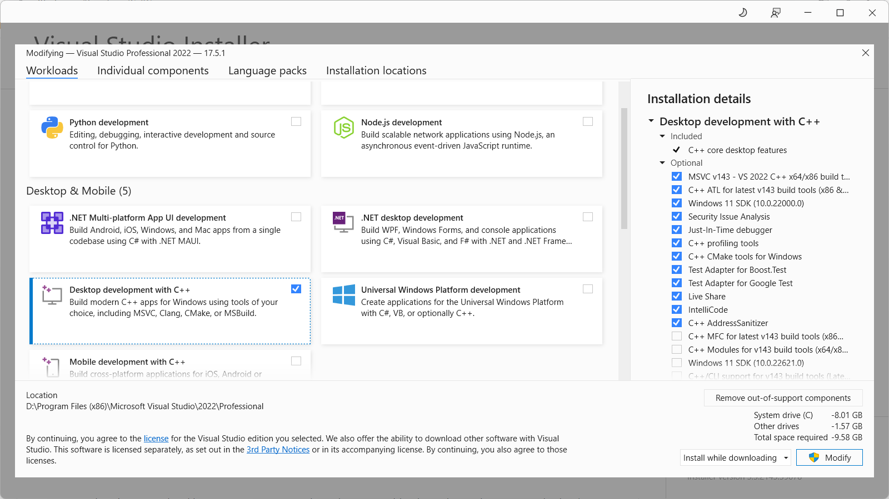

简体中文 | [English](README.md)

# Fluorescent Cell Generation Document

医学图像分割算法能够从自动特定组织图像中提取关键信息，免除了临床上手工勾画医学图像所耗费的巨额时间，从而成为学者们研究的热点。针对现有医学图像分割算法衡量分割性能时需要高精度标注的细胞数据集作为支撑，而人工标注的细胞不可避免地存在误差，不利于模型的泛化这一问题，本方法提出一种基于条件生成对抗网络的细胞生成方法。首先利用StyleGAN3网络训练细胞的掩膜（Mask）得到可以控制风格（Style）信息的Mask图像，然后通过Pix2PixHD网络训练特征，并将上一步得到的Mask图片作为输入，得到完全符合语义信息的细胞图片。最后，本方法将得到的细胞图像输入到现有医学图像分割算法中衡量模型的性能，真实地反应出各算法之间的优劣。

在图片生成的过程中采用了StyleGAN3, pix2pixHD模型，具体技术细节如下：


## Requirements

- 支持 Linux 和 Windows 操作系统，但基于性能和兼容性的考虑，建议使用 Linux 操作系统运行该项目。
- 要求至少 1 至 8 个高端 NVIDIA 显卡，每个显卡至少拥有 12 GB 的内存。
- 要求使用 64 位 Python 3.8 和 PyTorch 1.12.0 或以上版本。请参阅 [https://pytorch.org](https://pytorch.org/) 获取 PyTorch 的安装说明。同时需要安装 CUDA toolkit 11.6 或以上版本。
- 对于 Linux 系统，需要 GCC 7 或以上版本的编译器；对于 Windows 系统，需要使用 Visual Studio 编译器。建议的 GCC 版本取决于 CUDA 版本，例如 [CUDA 11.6 系统要求](https://docs.nvidia.com/cuda/archive/11.6.0/cuda-installation-guide-linux/index.html#system-requirements)。
- Python 库依赖见`environment.yml `文件。您可以使用 Miniconda3/Anaconda3 中的以下命令创建和激活名为 cell 的 Python 环境：
  - `conda env create -f environment.yml`
  - `conda activate cell`

## 1.Stylegan3

### 1.1 Preparing datasets

你可以将图片放入一个文件夹中来创建你的自定义数据集; 通过 `python dataset_tool.py --help` 获取更多细节信息。另外，该文件夹也可以直接作为数据集使用，不需要先运行 `dataset_tool.py` , 但这样做可能会导致次优的效果。

```python
# Original 1024x1024 resolution.
python dataset_tool.py --source=./your/path/images1024x1024 --dest=./datasets/images-1024x1024.zip

# Scaled down 256x256 resolution.
python dataset_tool.py --source=./your/path/images1024x1024 --dest=~/datasets/images-256x256.zip \
--resolution=256x256
```

请注意，上述命令会使用文件夹中所有类别的全部图像创建一个单一的组合数据集，与StyleGAN3论文中使用的设置相匹配。另外，你也可以为每个类别创建一个单独的数据集。

```python
python dataset_tool.py --source=./your/path/cell1024x1024 --dest=~/datasets/cell-1024x1024.zip
python dataset_tool.py --source=./your/path/nucleus1024x1024 --dest=~/datasets/Nucleus-1024x1024.zip
```

### 1.2 Training

你可以使用`train.py`训练新的网络。比如：

```python
# Train StyleGAN3-T for Dataset using 8 GPUs.
python train.py --outdir=~/training-runs --cfg=stylegan3-t --data=~/datasets/images-1024x1024.zip \
    --gpus=8 --batch=32 --gamma=8.2 --mirror=1

# Fine-tune StyleGAN3-R for Dataset using 1 GPU, starting from the pre-trained FFHQ-U pickle.
python train.py --outdir=~/training-runs --cfg=stylegan3-r --data=~/datasets/images-1024x1024.zip \
    --gpus=8 --batch=32 --gamma=6.6 --mirror=1 --kimg=5000 --snap=5 \
    --resume=https://api.ngc.nvidia.com/v2/models/nvidia/research/stylegan3/versions/1/files/stylegan3-r-ffhqu-1024x1024.pkl

# Train StyleGAN2 for Dataset at 1024x1024 resolution using 8 GPUs.
python train.py --outdir=~/training-runs --cfg=stylegan2 --data=~/datasets/images-1024x1024.zip \
    --gpus=8 --batch=32 --gamma=10 --mirror=1 --aug=noaug
```

注意，训练的质量和时间在很大程度上取决于确切的选项。最重要的选项如（"--gpus"、"--batch "和"--gamma"）必须被谨慎地指定。完整的选项列表见`python train.py --help`和[训练配置](./docs/configs.md)，阅读以了解一般准则和建议，以及不同情况下的预期训练速度和内存使用情况。

每次训练运行的结果都保存在一个新创建的目录中，例如`~/training-runs/00000-stylegan3-t-afhqv2-512x512-gpus8-batch32-gamma8.2`。训练循环以一定的时间间隔（由`--snap`控制）输出网络模型（`network-snapshot-<KIMG>.pkl`）和随机图像网格（`fakes<KIMG>.png`）。对于每个导出的网络模型，它将评估FID值（由`--metrics`控制，FID是一种度量两个图片数据集相似度的方法，生成的图片与真实图片越相似越好，相似度高对应的是FID值小。）并将结果记录在`metric-fid50k_full.jsonl`中。模型还将在`training_stats.jsonl`中记录各种统计数据，以及`*.tfevents`（如果已安装TensorBoard）。

### 1.3 Testing

训练后的网络被存储为`*.pkl`文件，可以使用本地文件名进行使用：

```python
# Generate an image using a model .
python gen_images.py --outdir=~/out --trunc=1 --seeds=2 \
    --network=~/training-runs/00000-stylegan3-r-labels1024x1024-gpus1-batch2-gamma8.8/network-snapshot-000220.pkl
    # Generate multiple images using a model .
python gen_images.py --outdir=~/out --trunc=1 --seeds=1-100 \
    --network=~/training-runs/00000-stylegan3-r-labels1024x1024-gpus1-batch2-gamma8.8/network-snapshot-000220.pkl
```

### 1.4 Image Converter

为确保StyleGAN生成的图片为二值化的图片，您可以使用`Tools/Threshold.py`将生成的图片转化为标准的黑白二值图像。

## 2.Pix2pixHD

### 2.1 Introduction

pix2pixHD可以实现高分辨率图像生成和图片的语义编辑。从语义图到真实图的生成是一个一对多的映射，理想的模型应该可以根据同一个语义图生成真实且多样的图片。pix2pix的解决方法是在输入中增加一个低维特征通道。

- 原始图片经过编码器，然后进行instance-wise average pooling操作，对每一个目标实例计算平均特征(Features)，来保证每个目标实例特征的一致性。这个平均特征会被broadcast到该实例的每一个像素位置上。
- 输入图像比较多时，Features的每一类像素的值就代表了这类物体的先验分布。 使用编码器对所有训练图像提取特征，再进行K-means聚类，得到K个聚类中心，以K个聚类中心代表不同的风格。
- 在推理阶段，从K个聚类中心选择某一个，和语义标签信息、实例信息结合作为输入，这样就能控制颜色/纹理风格。

### 2.2 Training

```python
# Traina model at 1024 x 1024 resolution
python train.py --name cell--label_nc 0 --dataroot ./your/data/path/ --no_instance
```

要查看训练结果，请在 `./checkpoints/cell/web/index.html` 中查看中间结果。 如果您已安装了tensorflow，则可以通过在训练脚本中添加 `--tf_log` 来查看 `./checkpoints/cell/logs` 中的tensorboard日志

#### Training with your own dataset

- 如果你想用自己的数据集进行训练，请生成单通道的标签图，其像素值与物体标签相对应（即0,1,...,N-1，其中N是标签的数量）。这是因为我们需要从标签图中生成one-hot向量。在训练和测试过程中，也请标明`--label_nc N`。
- 如果你的输入不是标签图，请直接指定`--label_nc 0`，这将直接使用RGB颜色作为输入。然后文件夹应该命名为`train_A`，`train_B`，而不是`train_label`，`train_img`，目标是将图像从A转化成B。
- 如果你没有实例信息或不想使用它们，请指定`--no_instance`。
- 预处理的默认设置是`scale_width`，它将把所有训练图像的宽度扩展到`opt.loadSize`（1024），同时保持长宽比。如果你想要不同的设置，请使用`--resize_or_crop`选项来变更设置。例如，用`scale_width_and_crop`首先调整图像的大小，使其具有`opt.loadSize`的宽度，然后进行`（opt.fineSize, opt.fineSize）`随机裁剪。`crop`跳过调整大小的步骤，只进行随机裁剪。如果你不需要任何预处理，请指定`none`，它除了确保图像能被32整除外将不进行额外的操作。

### 2.3 Testing

```python
# Test the model
python test.py --name cell --label_nc 0 --no_instance --which_epoch 80 --how_many 10
```

### 2.4 Details

由于荧光点的信号往往非常弱，因此荧光细胞图像中荧光点的生成和分析是非常困难的。直接利用Pix2PixHD 网络难以生成真实的荧光点。

但是在Pix2pixHD中你可以同时训练您的细胞图像以及荧光点图像，荧光点的Mask可以通过二维高斯分布生成，我们在`Tools/Points.py`中提供了此功能。

- $x_i$和$y_i$是为二维高斯数据的中心点；
- 如果你的细胞图像偏圆形，您可以使用`shifted_gaussian = np.random.randn(n_samples, 2)`来生成您的数据点；
- 如果您的细胞图像偏扁状，你可以使用：

```python
# generate zero centered stretched Gaussian data
C = np.array([[-5, 2], [5, 0]])
stretched_gaussian = np.dot(np.random.randn(n_samples, 2), C)
```

将生成的荧光点Mask输入到训练好的Pix2PixHD荧光点生成模型生成逼真的荧光点图像，随后您可以通过`Tools/Combine.py`将荧光图像与荧光点叠加。

### 2.5 More Training/Test Details

- Flags: see `options/train_options.py` and `options/base_options.py` for all the training flags; see `options/test_options.py` and `options/base_options.py` for all the test flags.
- 标志：所有训练设置见`options/train_options.py`和`options/base_options.py`；所有测试设置见`options/test_options.py`和`options/base_options.py`。
- 实例信息：我们同时接受标签和实例信息作为输入。如果你不想使用实例信息，请指定标志`--no_instance`。


## 3.Image Segmentation

在这个阶段，我们将使用生成的数据集来比较各种分割算法的性能。这个过程涉及将生成的数据集输入到不同的分割算法中，然后评估它们的表现和效果。通过比较不同的算法，我们可以找到最适合特定任务的分割算法，这可以帮助我们在实际应用中提高分割的准确性和效率。这样做可以减少人工分割的工作量，并且可以加快分析大量数据的速度，同时也有助于发现一些隐藏在数据中的模式和结构。最终，这个过程有望提高我们对数据的理解和认识，为进一步的研究和应用奠定基础。

### 3.1 [Cellpose](https://www.cellpose.org/)

传统的分水岭方法对于有明确边界的对象能够取得较好的分割效果，因为该算法能形成一个个小的“盆地”，这些盆地就代表一个个对象。但是，大多数情形下，不同的对象形成不同“深度”（强度）的盆地，很难统一进行分割。因此，创建一个关于对象的中间表达Intermediate Representation，来形成统一的拓扑盆地，就是一个很好的方法。Cellpose做的就是对Mask进行模拟扩散Simulated Diffusion，形成一个矢量场的拓扑映射。

#### Run Cellpose in GUI

```python
# Install cellpose and the GUI dependencies from your base environment using the command
python -m pip install cellpose[gui]

# The quickest way to start is to open the GUI from a command line terminal.
python -m cellpose
```

- 在GUI中加载图像（拖入图像或从File菜单中加载）；
- 设置模型：Cellpose中有两个模型，cytoplasm和nuclei，即细胞质模型和细胞核模型。
- 设置通道：选择要分割的图像通道，如果想分割细胞质，即选择green通道；如果想分割细胞核，则选择red/blue通道。如果是分割细胞质，且图中还有细胞核，则将chan设置为细胞质所在通道，而chan2通道设置为细胞核所在通道；如果分割细胞质但里面没有细胞核，则只设置chan即可，chan2设为None；
- 点击calibrate按钮来预估图中物体的尺寸；也可以手动输入cell diameter来设置。该预估的尺寸会通过左下方的红色圆盘体现；
- 点击run segmentation来运行模型。可以通过是否勾选MASKS ON来调节是否显示分割后的掩膜。

#### Run Cellpose in Terminal

上面GUI界面中的参数输入同样可以通过命令行模式来实现：

```python
python -m cellpose --dir ~/images_cyto/test/ --pretrained_model cyto --chan 2 --chan2 3 --save_png
```

所有的参数可以通过help参数来查看：

```python
python -m cellpose -h
```

#### Run Cellpose in Code

与上面两种方式类似，也可以在Python代码中直接调用Cellpose进行编程：

```python
from cellpose import models
import skimage.io

model = models.Cellpose(gpu=False, model_type='cyto')

files = ['img0.tif', 'img1.tif']

imgs = [skimage.io.imread(f) for f in files]

masks, flows, styles, diams = model.eval(imgs, diameter=None, channels=[0,0],
                                         threshold=0.4, do_3D=False)
```

### 3.2 Cellpofiler

[CellProfiler](https://cellprofiler.org/)是由哈佛和MIT的Broad Institute开发的一款免费软件，旨在让生物学家无需计算机视觉或编程方面的培训，即可自动定量测量数千张图像的表型。

### 3.3 Deepcell

研究人员开发了一种深度学习的分割算法，Mesmer（由一个 ResNet50 主干和一个特征金字塔网络组成），其实现了关键细胞特征的自动提取，如蛋白质信号的亚细胞定位，达到了人类水平的性能。

#### Run Deepcell

访问[deepcell.org](https://deepcell.org/)上预训练的深度学习模型。该网站允许你轻松上传示例图像，在可用模型上运行，并下载结果，不需要任何本地安装。

### 3.4 Mask R-CNN

#### Introduction

Mask R-CNN算法流程如下：

- 将图片输入到一个预训练好的神经网络中（ResNeXt等）获得对应的feature map；
- 对Feature Map中的每一点设定预定个的ROI，从而获得多个候选ROI；
- 将候选的ROI送入RPN网络进行二值分类（前景或背景）和BB回归，过滤掉一部分候选的ROI；
- 对剩下的ROI进行ROIAlign操作（即先将原图和Feature Map的Pixel对应起来，然后将Feature Map和固定的Feature对应起来）；
- 对ROI进行分类（N类别分类）、BB回归和MASK生成（在每一个ROI里面进行FCN操作）。

### 3.5 U2-Net

U2 -Net 的架构是一个两级嵌套的 U 结构。

- 提出残差 U 块 (RSU) 中混合了不同大小的感受野，它能够从不同的尺度捕获更多的上下文信息。
- 这些 RSU 块中使用了池化操作，它增加了整个架构的深度，而不会显著增加计算成本。

## 4.Tips

如果您使用Windows运行代码，您需要首先安装Visual Studio，安装C++桌面开发的库。并且配置VS的环境变量Path、LIB和INCLUDE，它们的内容可能是：



- Path=C:\Program Files (x86)\Microsoft Visual Studio\2017\Community\VC\Tools\MSVC\14.16.27023\bin\Hostx64\x64;

- LIB=C:\Program Files (x86)\Microsoft Visual Studio\2017\Community\VC\Tools\MSVC\14.16.27023\lib\x64;
- INCLUDE=C:\Program Files (x86)\Microsoft Visual Studio\2017\Community\VC\Tools\MSVC\14.16.27023\include;

